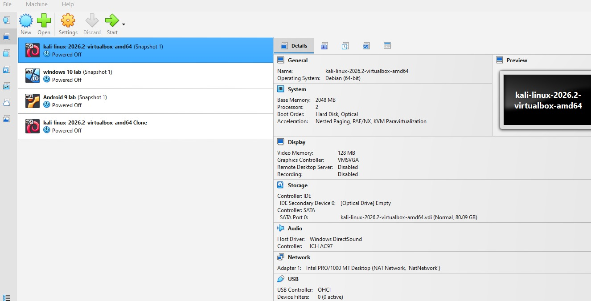

# NETWORKWALKS-AlphaTango-B083-WK1-PM1-CYBERSECURITY-LAB-SETUP

## Week 1 Project: Cybersecurity & Pentesting Lab Setup

### Steps I Followed:
1. Downloaded and installed VirtualBox.
2. Downloaded the Kali Linux ISO file.
3. Created a new Virtual Machine in VirtualBox.
4. Installed Kali Linux on the Virtual Machine.
5. Configured the network settings for the lab.

### Screenshots:
- 

### Troubleshooting:
- Problem: No major issues faced.
- Solution: N/A
